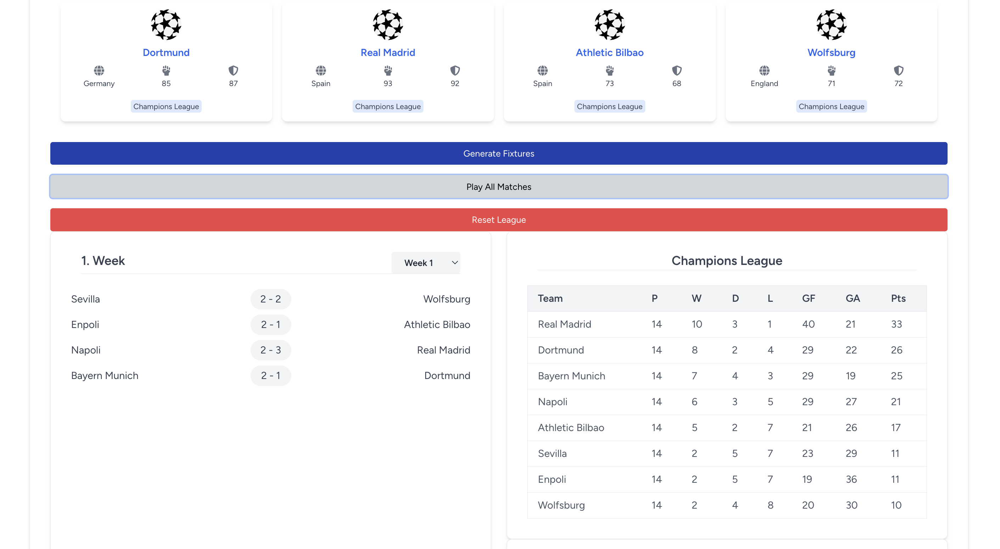
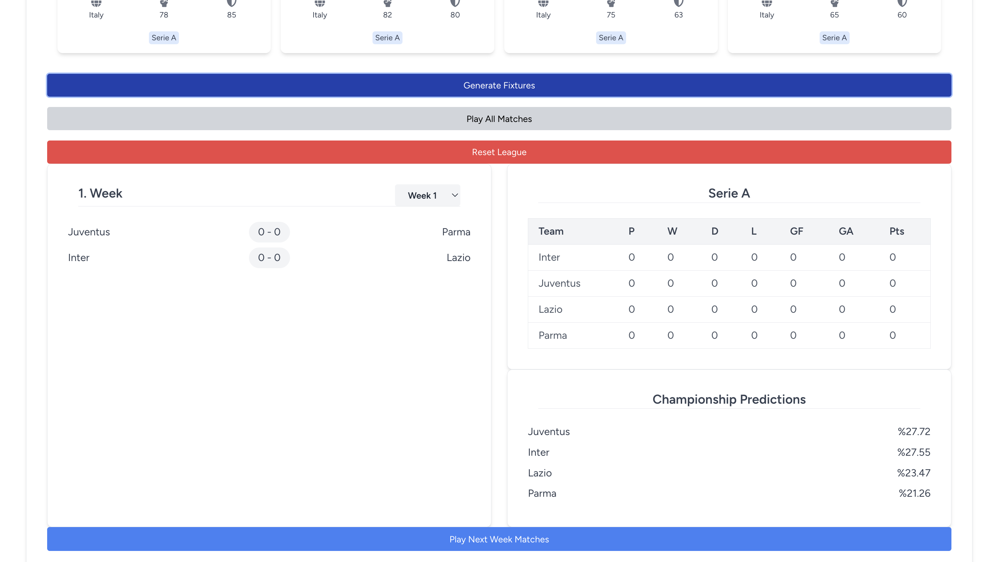
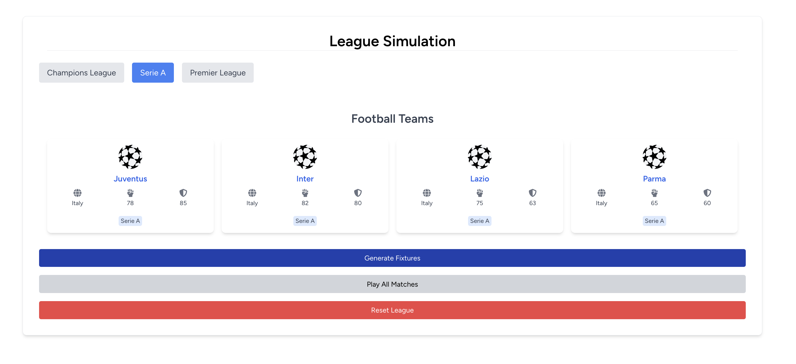
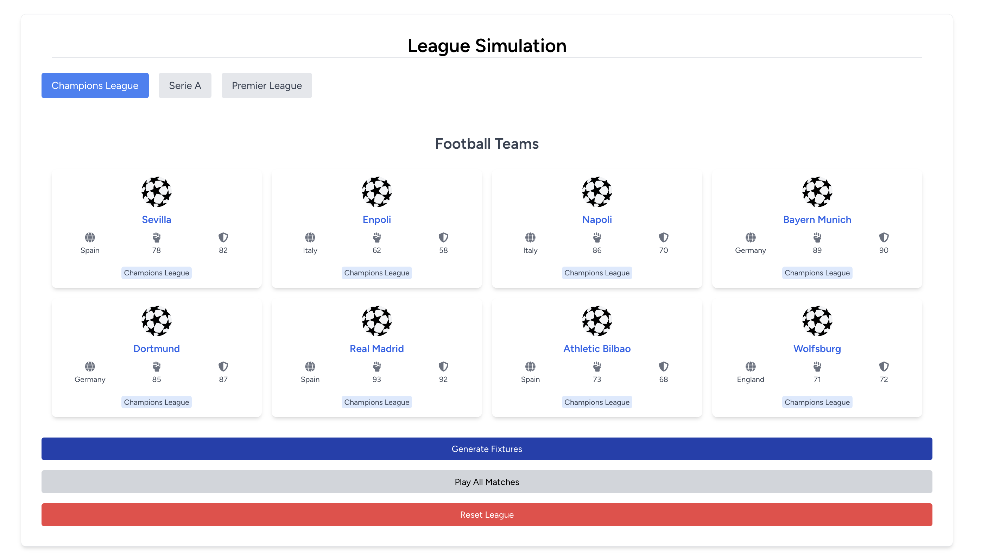
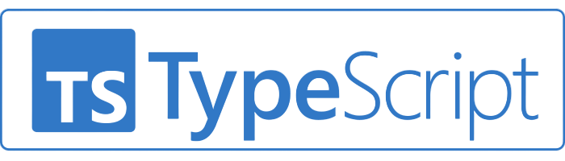
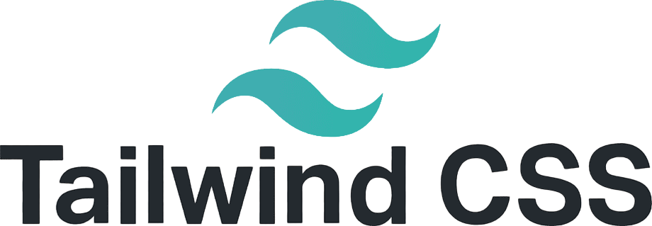

# Championship Simulation Program

If you want to be able to directly examine the project with the data as shown in this screen, you should run “php artisan migrate” and “php artisan DB:SEED”.






This project is a championship simulation program developed using the following technologies:
 
 
 
 


- **Laravel**: A PHP framework for building web applications.
- **React**: A JavaScript library for building user interfaces.
- **TypeScript**: A typed superset of JavaScript that compiles to plain JavaScript.
- **Vite**: A modern frontend build tool that focuses on speed and performance.
- **Tailwind CSS**: A utility-first CSS framework for creating custom designs.

It allows users to simulate the performance of different teams and offers a visually appealing interface.

## Getting Started

Follow these steps for a smooth setup of the project:

### Requirements

- PHP 8.2 or higher
- Composer
- Node.js (with npm)
- A database (MySQL)

### Installation

1. **Install Composer**:
   To install Composer, run the following command in your terminal:
   ```bash
   composer install
   ```

2. **Navigate to Project Directory**:
   Change into the project directory:
   ```bash
   cd project-name
   ```

3. **Environment Variables**:
   Create the `.env` file and configure your database settings:
   ```bash
   cp .env.example .env
   ```

4. **Database Migrations and Seeders**:
   To create database tables and insert initial data, run:
   ```bash
   php artisan migrate
   php artisan db:seed
   ```

5. **Node.js and NPM Installation**:
   To add dependencies to the project, run:
   ```bash
   npm install
   ```

6. **Start Development Server**:
   To run the project in development mode, use:
   ```bash
   npm run dev
   ```

### Tailwind CSS Setup

To use Tailwind CSS, you need to configure the `tailwind.config.js` file. If you haven't installed Tailwind yet, you can add it by running:
```bash
npm install -D tailwindcss postcss autoprefixer
npx tailwindcss init -p
```

Then, update the `tailwind.config.js` file like this:
```javascript
module.exports = {
  content: [
    "./resources/**/*.blade.php",
    "./resources/**/*.js",
    "./resources/**/*.vue",
  ],
  theme: {
    extend: {},
  },
  plugins: [],
}
```

### Running the Project

Once the project is successfully set up, you can run your application using the following command:
```bash
php artisan serve
```
Then, navigate to `http://localhost:8000` in your browser to view your application.

## Contributing

If you would like to contribute to this project, please open an issue first, and then submit a pull request.

## License

This project is licensed under the [MIT License](LICENSE).
